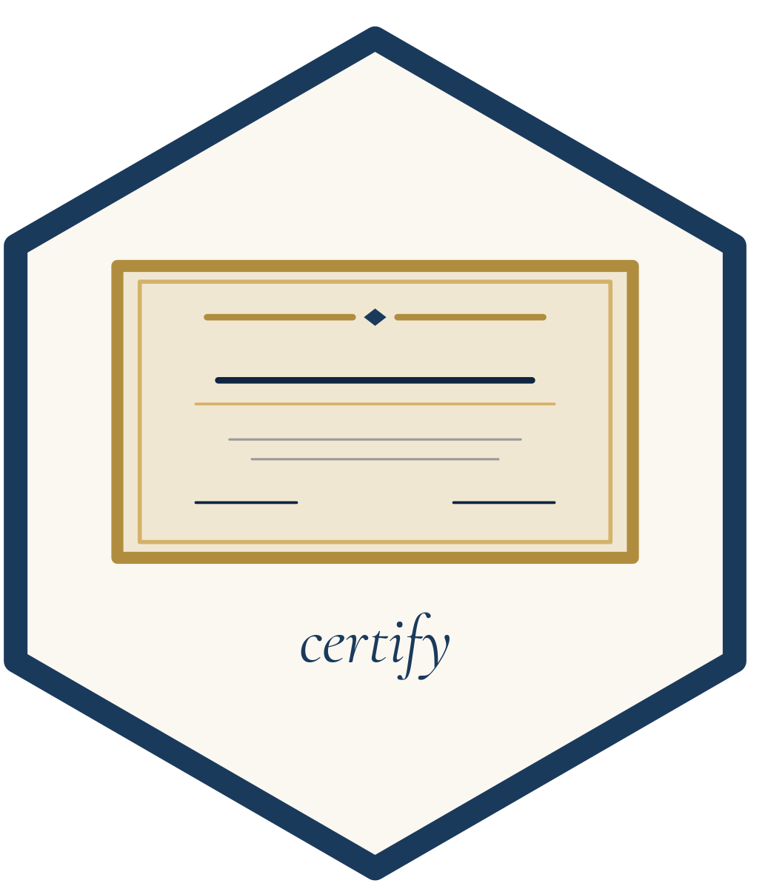
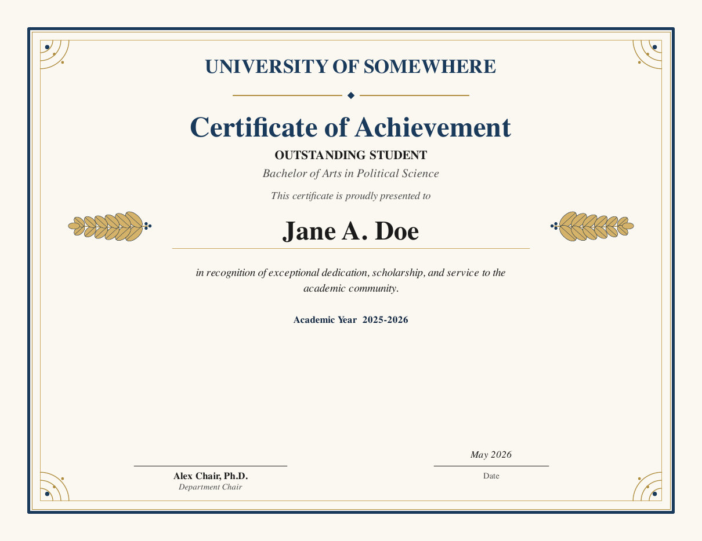

<!-- README.md is generated from README.Rmd. Please edit that file. -->

```{r, include = FALSE}
knitr::opts_chunk$set(
  collapse = TRUE,
  comment  = "#>",
  fig.path = "man/figures/README-",
  out.width = "100%"
)
```

# certify 

<!-- badges: start -->
[](https://CRAN.R-project.org/package=certify)
[](https://github.com/cwimpy/certify/actions/workflows/R-CMD-check.yaml)
[](https://lifecycle.r-lib.org/articles/stages.html#experimental)
<!-- badges: end -->

`certify` produces formal landscape PDF certificates with configurable
color themes, optional logos, decorative borders, laurels, and corner
ornaments. The package is built on `grid` only — no LaTeX or Quarto
installation is required.



## Getting started

A step-by-step walkthrough, written for occasional R users, is included as a
vignette:

```r
vignette("certify")
```

## Installation

Install the released version from CRAN:

```r
install.packages("certify")
```

Or install the development version from GitHub. `build_vignettes = TRUE`
is worth including: without it the vignette is not built, and
`vignette("certify")` finds nothing.

```r
# install.packages("remotes")
remotes::install_github("cwimpy/certify", build_vignettes = TRUE)

vignette("certify")   # the walkthrough
```

## Usage

```r
library(certify)

make_certificate(
  path          = "jane_doe.pdf",
  recipient     = "Jane A. Doe",
  title         = "Certificate of Achievement",
  award_name    = "Outstanding Student",
  organization  = "University of Somewhere",
  program       = "Bachelor of Arts in Political Science",
  citation      = paste(
    "in recognition of exceptional dedication, scholarship,",
    "and service to the academic community."
  ),
  academic_year = "2025-2026",
  signers       = list(
    list(name = "Alex Chair, Ph.D.", title = "Department Chair")
  )
)
```

## Themes

Three preset palettes are included:

* `cert_theme_classic()` — navy and gold on parchment (default)
* `cert_theme_formal()` — black and silver on cream
* `cert_theme_warm()` — burgundy and gold on warm cream

For full control, build a custom palette with `cert_theme()`:

```r
my_theme <- cert_theme(
  primary      = "#003366",
  primary_dark = "#001f3f",
  accent       = "#c0a062",
  background   = "#fbf8f1"
)

make_certificate(
  path      = "custom.pdf",
  recipient = "Recipient Name",
  theme     = my_theme
)
```

## A whole roster at once

`make_certificates()` takes a data frame and writes one PDF per row.

```r
roster <- read.csv("roster.csv")   # a `recipient` column is all you need

make_certificates(
  roster,
  dir          = "certificates",
  organization = "University of Somewhere",
  signers      = list(
    list(name = "Alex Chair, Ph.D.", title = "Department Chair")
  )
)
```

Columns named after `make_certificate()` arguments (`award_name`,
`citation`, and so on) vary per certificate; everything else stays constant.

## Paper size

`paper` accepts `"letter"` (the default, 11 x 8.5 landscape), `"legal"`,
`"tabloid"`, `"a3"`, `"a4"`, and `"a5"`. The design scales with the page.
`width` and `height` override it for anything else.

```r
make_certificate(path = "award.pdf", recipient = "Jane A. Doe", paper = "a4")
```

## Two signers and a custom logo

A logo must be a PNG. It replaces `organization` in the header and is scaled
to fit inside a box `logo_height` by `logo_width` inches (2 by 4.5 by
default), keeping its proportions: square logos are limited by height, wide
wordmarks by width.

```r
make_certificate(
  path      = "award.pdf",
  recipient = "Recipient Name",
  title     = "Certificate of Recognition",
  citation  = "in grateful recognition of years of devoted service.",
  signers   = list(
    list(name = "President Name", title = "President"),
    list(name = "Secretary Name", title = "Secretary")
  ),
  logo      = "path/to/your_logo.png",
  paper     = "a4",
  theme     = cert_theme_warm()
)
```

## License

MIT © Cameron Wimpy
