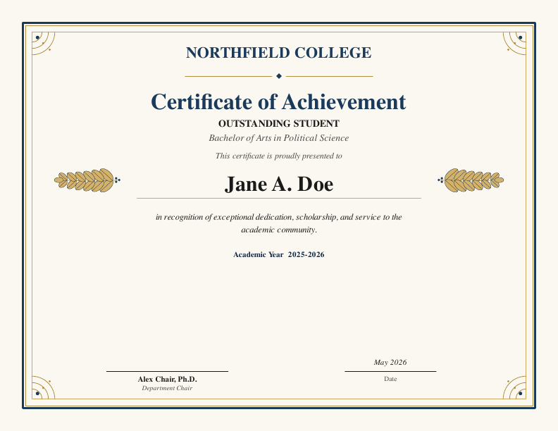
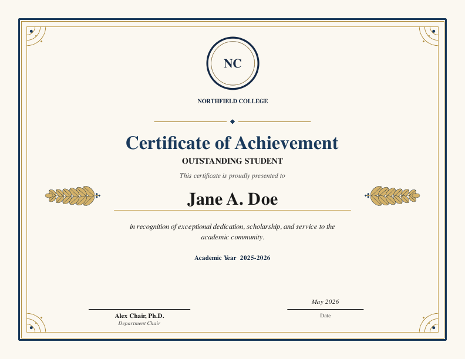
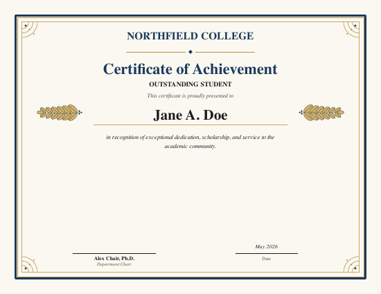
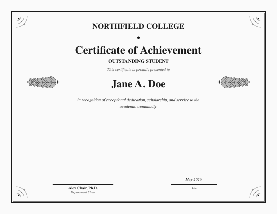
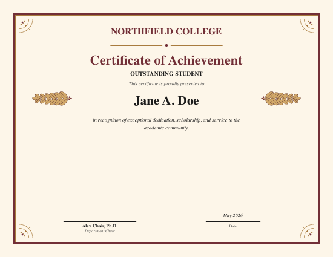
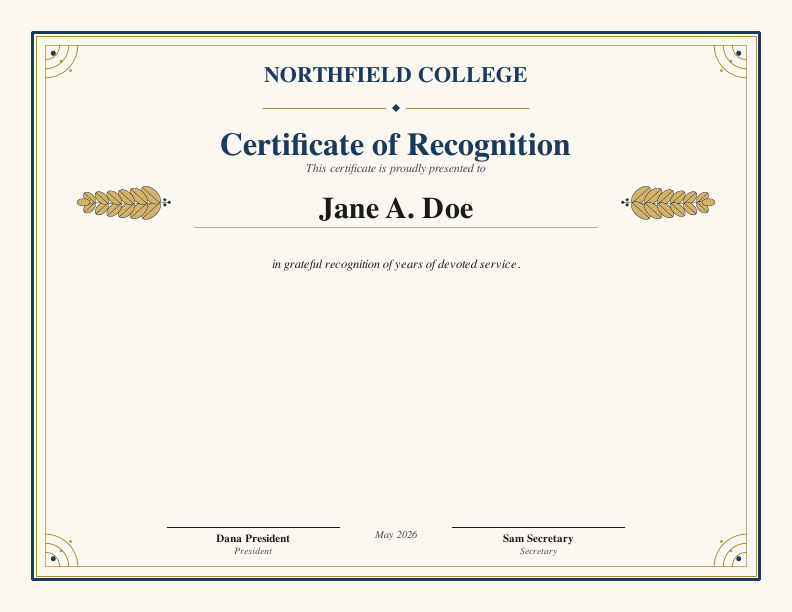

```{r, include = FALSE}
knitr::opts_chunk$set(
  collapse = TRUE,
  comment  = "#>",
  eval     = FALSE
)
```

certify makes printable PDF certificates: awards, recognitions, completion
certificates, anything that wants a border and a signature line. You give it
some text and it hands back a PDF.

There is no LaTeX or Word or Canva underneath it. The package draws the page
itself, so once R is installed nothing else has to be.

This guide assumes you have used R a little but do not write it for a living.
If you would rather work from a script you can edit line by line, there is one
included with the package:

```{r}
file.edit(system.file("examples", "make-a-certificate.R", package = "certify"))
```

## Install it once

```{r}
install.packages("certify")
```

Then, at the start of every R session where you want to make certificates:

```{r}
library(certify)
```

## Your first certificate

One function does everything: `make_certificate()`. Only two arguments are
required, `path` (where to save the file) and `recipient` (whose name goes on
it). Everything else is optional.

```{r}
make_certificate(
  path          = "~/Desktop/jane-doe.pdf",
  recipient     = "Jane A. Doe",
  title         = "Certificate of Achievement",
  award_name    = "Outstanding Student",
  organization  = "Northfield College",
  program       = "Bachelor of Arts in Political Science",
  citation      = paste(
    "in recognition of exceptional dedication, scholarship,",
    "and service to the academic community."
  ),
  academic_year = "2025-2026",
  signers       = list(
    list(name = "Alex Chair, Ph.D.", title = "Department Chair")
  )
)
```



The PDF lands wherever `path` says. `"~/Desktop/jane-doe.pdf"` puts it on your
Desktop; a bare `"jane-doe.pdf"` puts it in whatever folder R is currently
working in, which is easy to lose track of, so naming the folder is worth the
few extra characters.

To leave a line off the certificate, delete that whole argument, comma and all.
Drop `program` and the italic line under the award name disappears; drop
`academic_year` and the year line goes away.

The one rule when editing these calls: change the words inside the quotation
marks, and leave the quotation marks and commas where they are. A missing comma
is the cause of most errors here.

## Adding your logo

Point `logo` at a PNG file. The image goes in the header, and it takes the
place of `organization`, so you do not need both.

```{r}
make_certificate(
  path      = "~/Desktop/jane-doe.pdf",
  recipient = "Jane A. Doe",
  citation  = "in recognition of exceptional dedication and scholarship.",
  logo      = "~/Desktop/college-logo.png",
  signers   = list(
    list(name = "Alex Chair, Ph.D.", title = "Department Chair")
  )
)
```



Three things to know about the file itself.

**It has to be a PNG.** A `.jpg`, `.svg`, `.pdf`, or `.eps` will not work, and
R will tell you so. Most institutions publish a PNG version of their logo on a
brand or communications page. If all you have is another format, opening it in
Preview (Mac) or Paint (Windows) and saving it as PNG is enough.

**Use one with a transparent background if you can.** The certificate paper is
a warm off-white, so a logo saved on a solid white background shows up as a
white rectangle sitting on cream. Files labeled "transparent" or "for use on
color backgrounds" avoid this.

**Give R the full path.** Quotes around it, forward slashes even on Windows:

```{r}
logo = "~/Desktop/college-logo.png"                 # Mac
logo = "C:/Users/yourname/Desktop/college-logo.png" # Windows
```

If you are not sure what the path is, run `file.choose()` in the console, pick
the file, and R prints the path for you to copy.

### Getting the size right

The logo is scaled to fit inside a box, and it keeps its proportions, so it
never comes out stretched or squashed. The box is 2 inches tall and 4.5 inches
wide by default, and whichever edge the logo reaches first is what limits it:

* A square or vertical logo (a seal, a stacked logo with the name underneath)
  is limited by the height. It comes out 2 inches tall.
* A long horizontal wordmark is limited by the width. It comes out 4.5 inches
  wide and correspondingly shorter.

Either way the logo stays inside the decorative border, and the ornamental
divider moves up to sit just underneath it.

If the default looks wrong for your particular logo, change the box:

```{r}
# smaller and more restrained
logo_height = 1.4

# let a wide wordmark run closer to the edges
logo_width = 6

# both at once
logo_height = 1.6, logo_width = 6
```

Numbers are inches, and the page is 11 inches across. Making these too large
will crowd the title, so it is worth opening the PDF and looking after any
change.

## Paper size

The default page is 11 by 8.5 inches, US letter turned sideways, which
prints as-is on ordinary paper. In the print dialog choose **Actual Size**
rather than "Fit to Page", which would shrink it slightly and add a white
margin. The border sits far enough in from the edge that no printer clips it.

For anything else, name the size:

```{r}
paper = "letter"    # 11 x 8.5    (the default)
paper = "a4"        # 11.69 x 8.27
paper = "legal"     # 14 x 8.5
paper = "tabloid"   # 17 x 11
paper = "a3"        # 16.54 x 11.69
paper = "a5"        # 8.27 x 5.83
```

All of them are landscape, and the whole design scales with the paper, so
the type and ornaments grow on a large sheet instead of sitting letter-sized
in the middle of it. For a size that is not on the list, give the dimensions
in inches instead:

```{r}
width = 12, height = 9
```

## Colors

Three palettes come with the package:

```{r}
theme = cert_theme_classic()   # navy and gold on parchment (the default)
theme = cert_theme_formal()    # black and silver on cream
theme = cert_theme_warm()      # burgundy and gold on warm cream
```

<div style="display:flex; gap:6px; flex-wrap:wrap;">



</div>

To match your own institutional colors, build a palette with `cert_theme()`.
Colors are hex codes, the `#` followed by six characters that most brand
guides list. Only `primary` and `accent` really change the character of the
page; the rest have sensible defaults you can ignore.

```{r}
our_colors <- cert_theme(
  primary    = "#003366",   # borders and the big title
  accent     = "#c0a062",   # inner trim and the corner flourishes
  background = "#fbf8f1"    # the paper color
)

make_certificate(
  path      = "~/Desktop/jane-doe.pdf",
  recipient = "Jane A. Doe",
  logo      = "~/Desktop/college-logo.png",
  theme     = our_colors
)
```

Save that `our_colors` line at the top of your script and use
`theme = our_colors` on every certificate you make.

## Two signatures

Add a second entry to `signers`. The two signature lines sit side by side and
the date moves underneath them. Two is the maximum.

```{r}
signers = list(
  list(name = "Dana President", title = "President"),
  list(name = "Sam Secretary",  title = "Secretary")
)
```



## A stack of certificates from a spreadsheet

For a ceremony or a whole class, put the names in a spreadsheet and hand the
whole thing to `make_certificates()` (plural). It writes one PDF per row.

Save your list as a CSV with a `recipient` column. Add `award_name` and
`citation` columns too if people are getting different awards or different
wording; leave them out if everyone gets the same.

| recipient | award_name | citation |
|---|---|---|
| Jane A. Doe | Outstanding Student | for exceptional scholarship. |
| John B. Smith | Outstanding Service | for years of devoted service. |

```{r}
roster <- read.csv("~/Desktop/roster.csv")

make_certificates(
  roster,
  dir = "~/Desktop/certificates",

  # everything below is the same on every certificate
  title         = "Certificate of Achievement",
  logo          = "~/Desktop/college-logo.png",
  academic_year = "2025-2026",
  signers       = list(
    list(name = "Alex Chair, Ph.D.", title = "Department Chair")
  )
)
```

That is the whole thing. Files are named after the recipient, so
"Jane A. Doe" becomes `jane-a-doe.pdf`, and two people with the same name
get `-2` added rather than one quietly overwriting the other.

A few details worth knowing:

* Any column named after a `make_certificate()` argument is used. A column
  named something else is ignored, and you get a message listing what was
  ignored, which is how you catch a misspelled heading.
* An empty cell falls back to whatever you passed for the whole batch.
* If a column and an argument have the same name, the column wins.
* To control the file names yourself, add a `filename` column.

## Other things you can change

```{r}
show_laurels = FALSE            # drop the decorative sprigs beside the name

width = 11.69, height = 8.27    # A4 landscape instead of US letter

date_str = "May 2026"           # otherwise the current month and year

presented_text = "Awarded to"   # the small italic line above the name
```

## When something goes wrong

**"Logo not found at: ..."** — the path is wrong, or the file moved. Run
`file.exists("your/path/here.png")`. If it says `FALSE`, R is not looking where
you think it is. `file.choose()` will give you the correct path.

**The logo comes out as a white block.** The PNG has a white background rather
than a transparent one. See the note above.

**A warning about cairo, or R crashes when writing the PDF.** Some machines are
missing the graphics library certify prefers. Add `device = "pdf"` to the call
and it uses the plain PDF engine instead. The only difference you will notice is
that en-dashes and curly quotes get simplified to plain ones.

```{r}
make_certificate(
  path      = "~/Desktop/jane-doe.pdf",
  recipient = "Jane A. Doe",
  device    = "pdf"
)
```

**`unexpected symbol` or `unexpected ','`.** Almost always a missing comma
between arguments, or a missing closing quotation mark. Look at the line R
names and the one just above it.

**Nothing seems to happen.** `make_certificate()` writes a file and prints
nothing. That is success. Look in the folder you named in `path`.
